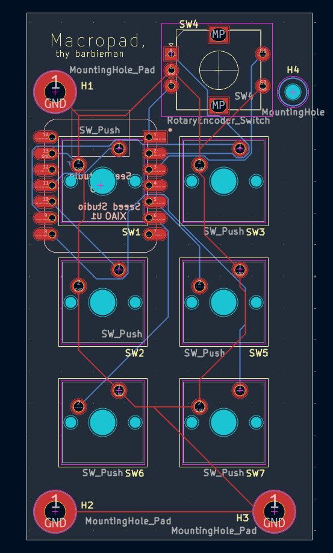

# CAD-hackpad
A macropad made to optimize commonly used commands/actions in Soldiworks CAD.

## Simple-ish explanation of project
It is split up into 6 buttons and 1 knob with diffrent purposes. This includes a button for choosing the plane/a plane, sketching on that plane, extruding as well as cutting and a simple enter button. Then its onto the last button and knob, the knobs rotation is used for adjusting numbers up and down in intervalls of (1-10-25)mm. Adjusting the interval is done with the button and the rotary encoder button is used for rounding this chosen number in solidworks to the closest 10. 

This project is supposed to effectivize CAD work but wont replace a regular keyboard and mouse. It bypasses some of the most repetetive mouse clicks that are usual for solidworks or CAD in general.

## Case assembly
The case assembly is split into a simple top and bottom. This can be 3D printed and is made so that this sanwich ice-cream looking hackpad doesnt feature any visible screws. On the top part of the case you can see 3 holes: these holes are intended to fit the guide-stick on the bottom case, as well as, 2 M3 heat innset. This makes it so that the screws can be secured safely and threaded through the bottom case making it so that no screws are visible. For assembly after getting the heatset innserts put in is simple: Line up the soldered PCB pointing seeduino down and beeing able to read "thy barbiemann", you also have to make sure that the seeduino is pointed towards the output port. Then you simply have 2 screws for easy accessibility.

## Note to reviwer 
I cant change the pcb location beacuse it already has been rodered. If you do grant me the funding i would love it and use it for a new pack of pin headers wich is what the Seeduino needs to stand off from the PCB. However regarding the usb-c it should all be accesible now.

## Bill of materials
1x XIAO RP2040
6x Cherry MX Switches
6x Blank DSA Keycaps
1x EC11 20mm Rotary Encoders
2x M3x16 Bolt
2x M3 Heatset

## Schematic (a little messy)

## PCB

