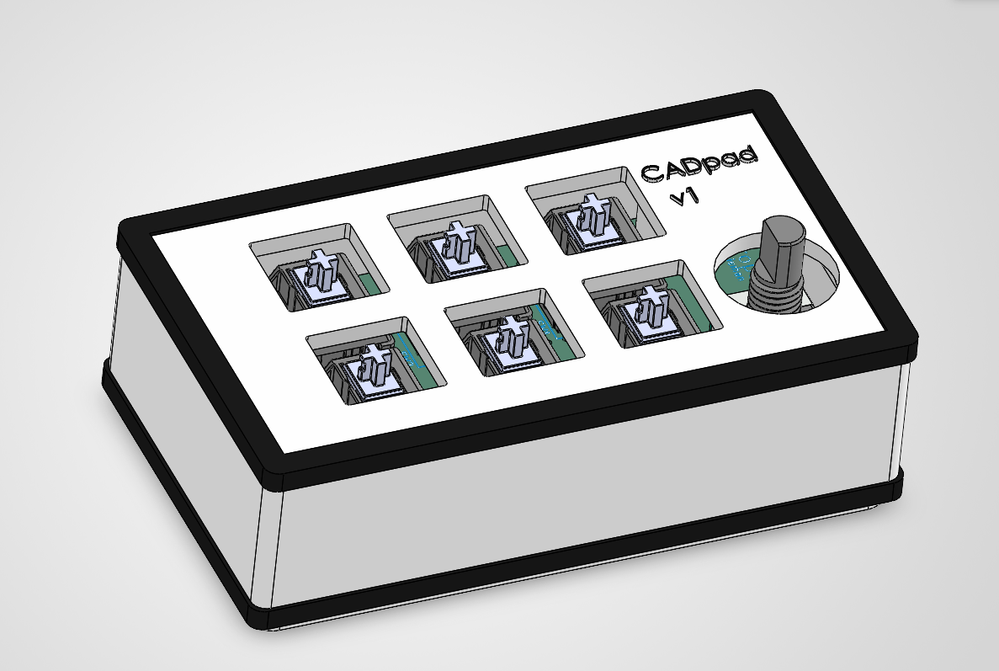
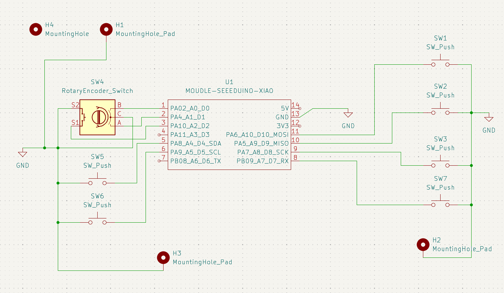

# CAD-hackpad
A macropad made to optimize commonly used commands/actions in Soldiworks CAD.

## Simple-ish explanation of project
It is split up into 6 buttons and 1 knob with diffrent purposes. This includes a button for choosing the plane/a plane, sketching on that plane, extruding as well as cutting and a simple enter button. Then its onto the last button and knob, the knobs rotation is used for adjusting numbers up and down in intervalls of (1-10-25)mm. Adjusting the interval is done with the button and the rotary encoder button is used for rounding this chosen number in solidworks to the closest 10. 

This project is supposed to effectivize CAD work but wont replace a regular keyboard and mouse. It bypasses some of the most repetetive mouse clicks that are usual for solidworks or CAD in general.

## Bill of materials
1x XIAO RP2040
6x Cherry MX Switches
6x Blank DSA Keycaps
1x EC11 20mm Rotary Encoders
3x M3x16 Bolt
3x M3 Heatset

## Schematic (a little messy)

## PCB

